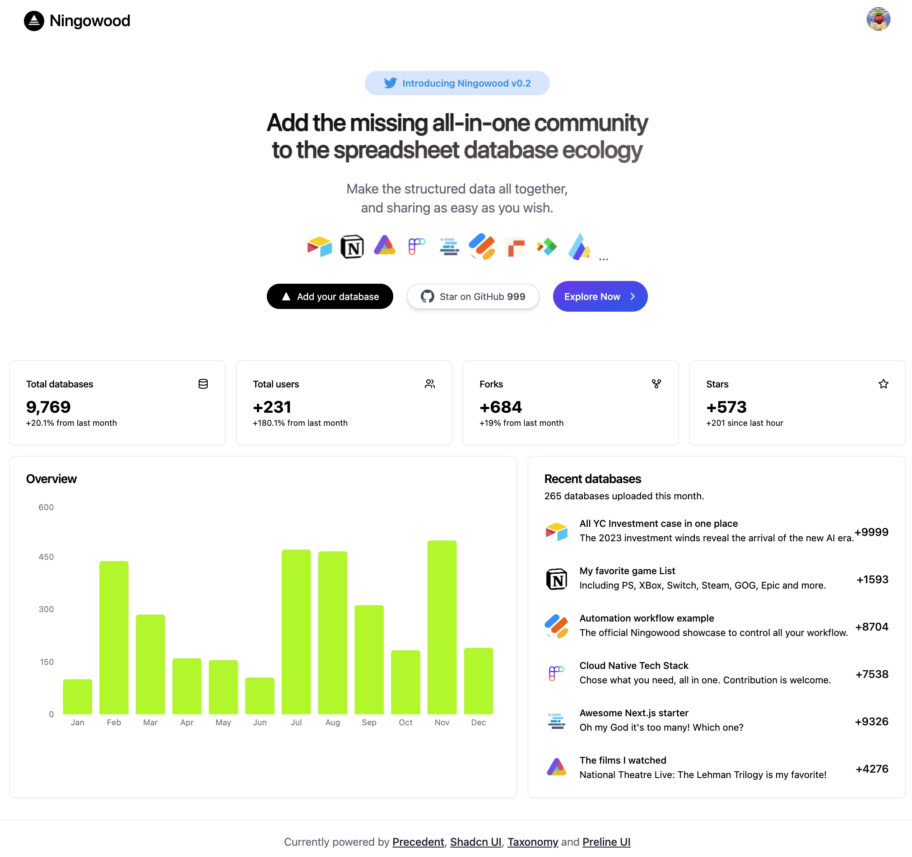

# [Lifetable](http://lifetable.ai) v0.2.0: Add the missing all-in-one community to the spreadsheet database ecology

## Read the newest artitle

[Ningowood v0.2.0: Add the missing all-in-one community to the spreadsheet database ecology](./blogs/2023-0618-ningowood-v0_2.md): in writing...

## Webinar resource

* 2023-XX-XX: (en-US)(Coming soon) share v0.2 to the global world in Youtube.
* 2023-06-12: (zh-CN)(Inner Resource) share v0.2 to MiraclePlus.
* 2022-11-26: (zh-CN)(Inner Resource) share v0.1 to freeCodeCamp, Tianjin, China.

## Development togehter

> Everything is just beginning, welcome your contribute!

* Git clone this monorepo.
* For v0.1: Independently install node_modules in both microfrontends/* and microbackends/*.
* Any development question new, please submit in [Issues](https://github.com/ningowood/ningowood/issues).

## Community

* Official Github Discussion: [Here](https://github.com/ningowood/ningowood/discussions).
* Official Discord Group: [Here](https://discord.gg/YeZQ8fegmq).
* Official Wechat Account: ningowood

## Notice

This is a first-period demo preview of Ningowood. After online registration, ur data starts to be collected in the cloud database. Register with your real email to receive further updates! (Only email will remain in the first stable release.)

## License

[SEE HERE](./LICENSE) for now.
