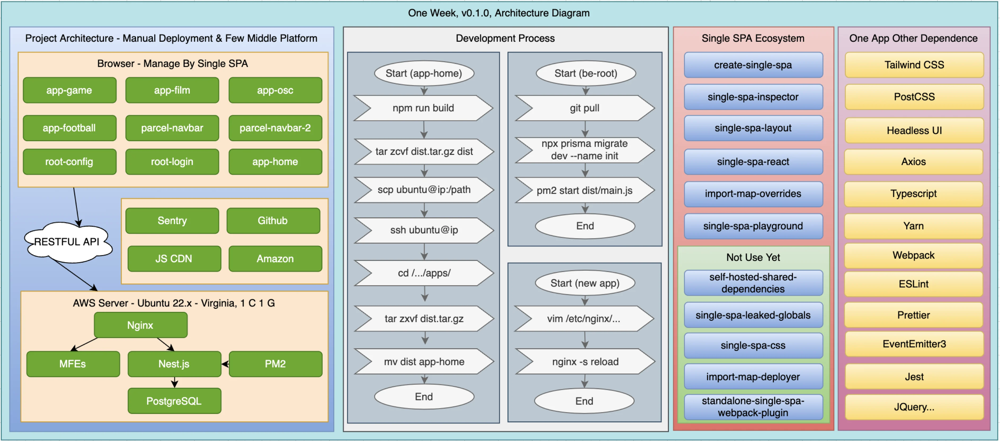
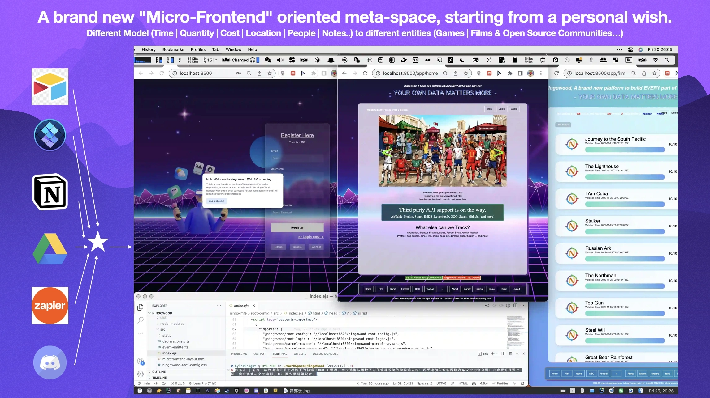

# [Ningowood](http://ningowood.com) v0.1.0 (2022-11-26): A brand new platform from the 7 years multi app experience of my own

Hola! Welcome to Ningowood! This is the dev log for version changing, and adding more introductions.

> Except the ***Dev Commit Log*** TOC, all other information is written at midnight of 2023-06-06, to prepare for the v0.2.0 release intros.

## What you can do in v0.1 & Technology detail behind the screen

### Landing Page (Register and Log in)

See a login page at first glance - Register or Login with your email through a hard code way. 

* Design Idea from Glassmorphism + Metaverse.
* Registration logic has no email format verification, save the AUTH in plaintext within LocalStorage API.
* Use just Tailwind CSS, and copied so much different UI demos to build this one.

### Dashboard (Data Matters)

When logged in, can see a dashboard intro card showing that we want to build an all-in-one data tracking app.

* And let the users know that it is time to reclaim the data of their own in every place around the Web.
* The tracking system wants to work with all well-known third-party APIs like AirTable, Notion, LetterboxD, GOG, Github, and more.

### Navigations (App Center)

At the bottom of the app, the two navigations on:

* The left side, showing that we can track ***Film***, ***Game***, ***Football***, ***OSC (Open Source Community) activities***, ***Resume history***, ***Blog lists***, ***Company data***, ***University memories***, ***OS Repo collections***, ***Medical activities*** and more to come.
* The right side, showing a big future after more data is collected in this platform, what we can do next - ***Market***, ***Explore***, ***Analysis***, ***3RD API integration***, ***Low code build tools***, and even more.

And also the apps opened by the navigations link show that:

* They all are in the same tracking UI with an add button and a list (logo, name, added date, and rate score).
* All backend code is built upon a very similar Data Model & CRUD logic in Nest.js.
* All frontend code is built upon the Single SPA ecosystem in the form of Root Config, Application, and Parcel.
* Each frontend app has different repo but is all organized in the only root folder - ```/microfrontends```
* They are all built into packages on the local machine and deployed to the cloud virtual machine manually (SFTP way).

## Dev Commit Log

* feat: can register, login, add game/film/... through a very simple way.
* feat: squash all the commits in local development and in 10+ micro frontends repo.
* build: determine the early technology stack using Single SPA, React, Prisma, Postgres, and more.
* build: all micro-project deployed into one US machine to serve the world.
* build: ready to share in 2022-1126 13:00 +8000, to first introduce to others.

## Technology Stack



## Screenshot in one place



## Attachments

The webinar sharing at The 4th Tianjin Web Front End Conference, 2022-11-26 (I was in a rented house in Beijing due to the severe lockdown period of COVID-19). Download below (in Chinese version).

> [2022-1126-webinar-sharing-hylerrix.pdf](https://github.com/ningowood/ningowood/releases/download/v0.1.0/2022-11-26-webinar-sharing-hylerrix.pdf) in Github CDN.
