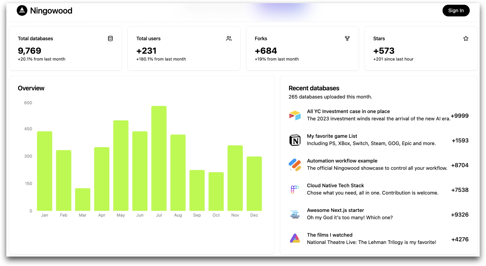

# [Ningowood](http://ningowood.com) v0.2.0 (2023.06.12): MirclePlus? Prepare for the one more thing -> LifeTable

Hola! Welcome to Ningowood! This is the dev log for version changing, and we added more introductions.

> All information is written at midnight of 2023-06-28. But this was already finalized on 2023-06-12 (the last day MirclePlus's 2023 autumn application should be delivered).

We sincerely want to share what happened during this long period and what's next after Ningowood v0.1 release (2022-11-26), but we finally moved it into the draft of the `Introducing Lifetable` article for future use.

## What you can do in v0.2 & Technology detail behind the screen

* See a brand new landing page of Ningowood, which introduces a new product - LifeTable.
  * Based on Next.js, Precedent, Shadcn UI, Taxonomy, Preline UI and more.
* First version of Lifetable will focus on adding the missing all-in-one community to the spreadsheet database ecology.
  * Support AirTable, Rowy, APItable, Notion, and so much more.
* The introduction cards concluded `Total databases`, `Total users`, `Forks`, `Stars`, `Overview` and `Recent databases`.
* See a third-party login modal - support only Google now, but can not use it yet.
* See a `Future App Preview` card showing what's next upper-layer application we want to build (Flowchats AI and Navigator AI) after the LifeTable release.

Ningowood repo will only focus on the website introduction in future versions.

## Dev Commit Log

* chore(version): decide this repo only focus on website intro & release v0.2
* feat(landing): determine to beyond LifeTable & build Micro-App-Center early
* feat(landing): init SsDB toolkit support intro
* fix: remove pnpm-lock & unused variable, bug fix
* feat: using shadcn dashboard ui to introduce more
* refactor: remove all unnecessary semi in Precedent
* feat: init first intro card in landing page
* chore: upgrade Next.js app to Precedent template
* chore: add basic information files to root path
* chore: init website app using Next.js

## Lifetable prototype

## Screenshot in landing page

## Attachments

Writing this PDF is driven by Mircalplus's 2023 autumn accelerator activity—no need to be passed to get the financing now. Download below (in Chinese and English bilingual versions).

[Introducing-Tablehub](https://github.com/ningowood/ningowood/releases/download/v0.2.0/2023-06-12-Introducing-Tablehub.pdf)
